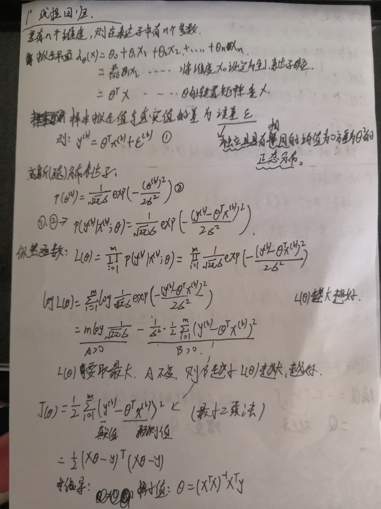

## 线性回归算法：

​	线性回归的基础是特征和结果满足线性关系。

## 原理：

## 梯度下降：

线性回归的参数不一定可求。
梯度下将的思想是获取数据后按照一个计算出来的方向接近。
目标函数：

​															loss = Σi(w*xi+b-yi)i
​				
$$
\mathtt{W}' = w - lr*\frac{\partial loss}{\partial w}
$$

$$
\mathtt{b}' = b - lr*\frac{\partial loss}{\partial b}
$$

$$
\mathtt{W}' * x +\mathtt{b}' \rightarrow y
$$

​						**lr**为步长，也称成学习率。